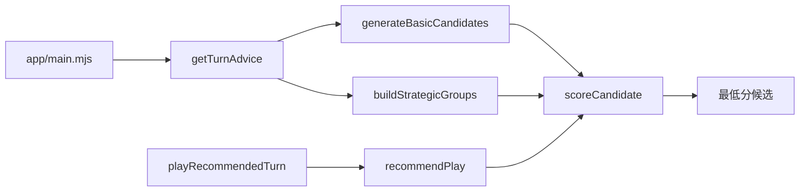

# 掼蛋教练 Pro — 架构

## 设计原则

1. **规则与策略分离**：`engine` 只回答「能不能出、谁更大」；`strategy` 回答「该不该出、出哪手」。
2. **评分可解释**：每个候选附带 `reasons[]`，便于复盘和人工纠偏。
3. **产品形态不变**：四人桌、你+队友 AI、即时建议、导出、问教练。

## 数据流

## 策略模块

| 模块 | 职责 |
|------|------|
| `table-context.mjs` | 队友/对手、危险度、炸弹库存 |
| `scorers/opponent-pressure.mjs` | 对手占牌必压；有普通压牌时过牌 +9200 量级 |
| `scorers/structure.mjs` | 拆炸弹重罚；跟牌时拆三张出对子轻罚 |
| `strategic-groups.mjs` | 自动理牌（连对仅 exact pair） |
| `recommend.mjs` | 汇总评分并选最优 |

## 扩展方向

- 从导出 JSON 增加更多回归用例（`tests/fixtures/`）
- 记牌与概率层（仍不交给 LLM 决策）
- 自博弈胜率审计（`tools/audit-auto-games.mjs` 可移植）
- **数据流水线 P0**：见 [DATA-PIPELINE.md](./DATA-PIPELINE.md)（`batch-auto-games` / `replay-to-rows` / 四座位 `rows.jsonl`）
